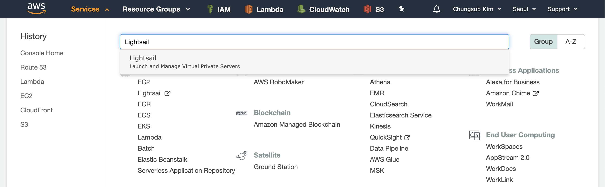
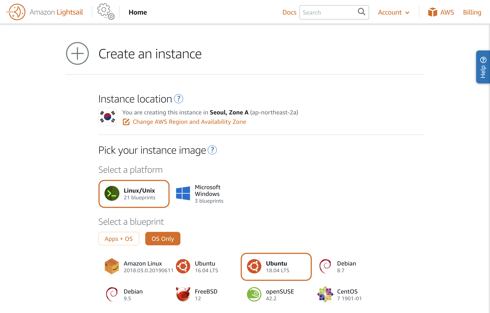
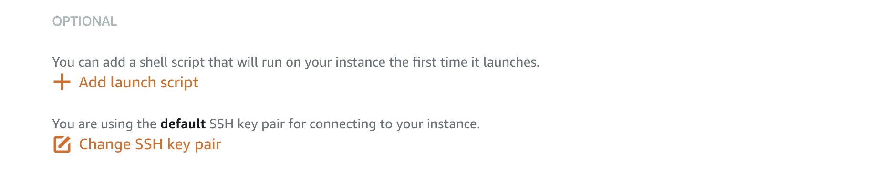
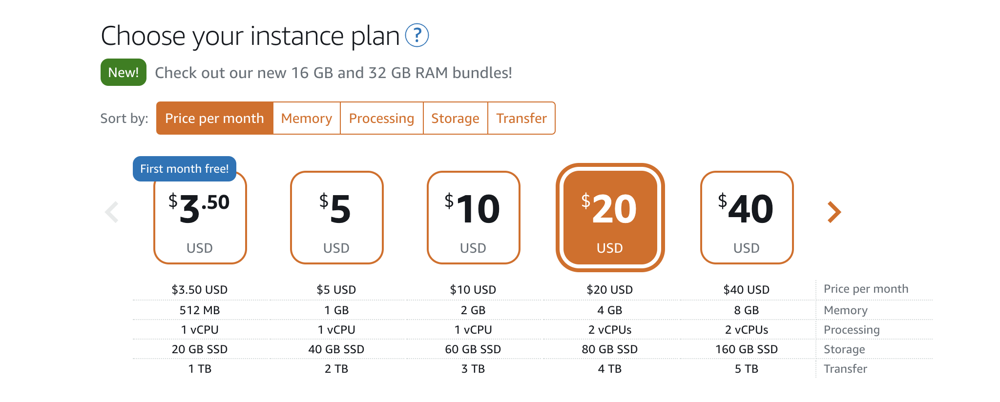
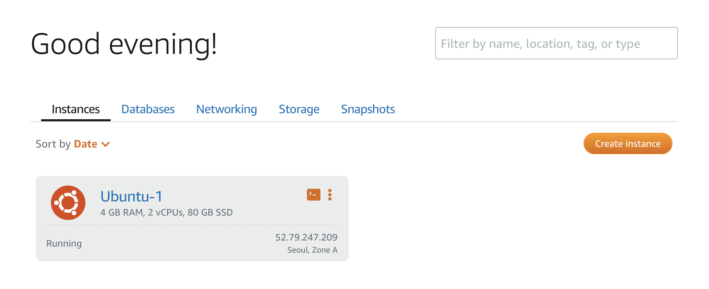
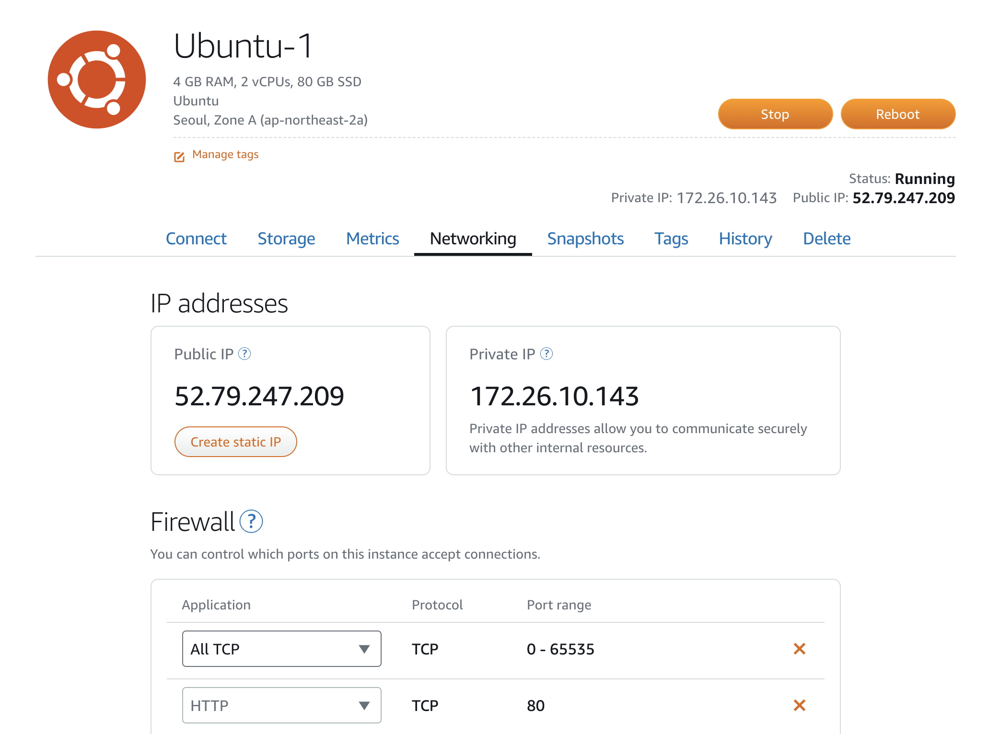
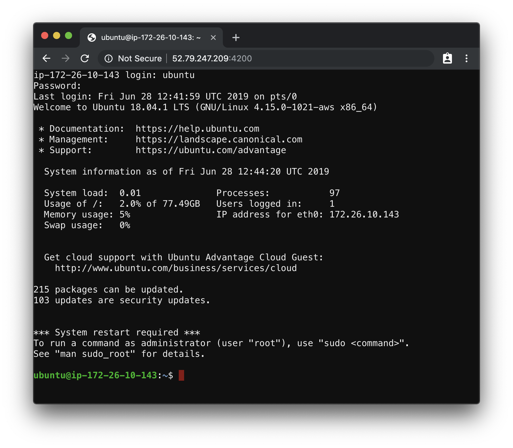

# Workshop 개발 환경 셋팅하기

workshop은 [AWS](https://aws.amazon.com/)의 [Lightsail](https://lightsail.aws.amazon.com/)을 이용하여 가상머신을 생성하여 실습합니다.
총 비용은 한달동안 사용했을때 약 $20이며 8시간 실습을 하면 약 500원 정도가 나옵니다.

다음과 같은 프로그램을 설치합니다.

- [wetty](https://github.com/krishnasrinivas/wetty) 웹 기반 terminal - http://xxxx:4200


## 가상 서버 생성

- AWS에 로그인 합니다.
- LightSail 메뉴로 이동합니다.



- 새로운 인스턴스를 생성합니다.


- Linux / Ubuntu 18.04를 선택합니다.



- Add launch script를 선택하고 다음과 같은 명령어를 입력합니다.

```sh
sed -i 's/PasswordAuthentication no/PasswordAuthentication yes/' /etc/ssh/sshd_config
echo "ubuntu:1q2w3e4r" | chpasswd
service sshd reload
apt-get -y update
apt-get -y install nodejs npm
npm install -g wetty
curl https://gist.githubusercontent.com/subicura/9058671c16e2abd36533fea2798886b0/raw/7f097962188d8e1a90fac1e8383e6087b1898a2a/wetty.service -o /lib/systemd/system/wetty.service
systemctl start wetty
systemctl enable wetty
```



- 2 vCPUs / 4 GB 또는 더 나은 사양을 선택합니다. (빠를수록 좋다!)



## 가상 서버 설정

가상 서버 생성이 완료되면 네트워크 방화벽을 모두 허용합니다.

- 생성한 가상서버를 선택합니다.



- 네트워크 방화벽을 모두 허용합니다.



- Public IP의 주소로 웹 터미널에 접속합니다. (화면상으로 보면 http://52.79.247.209:4200)

- ID: ubuntu, Password: 1q2w3e4r

## 결과화면


